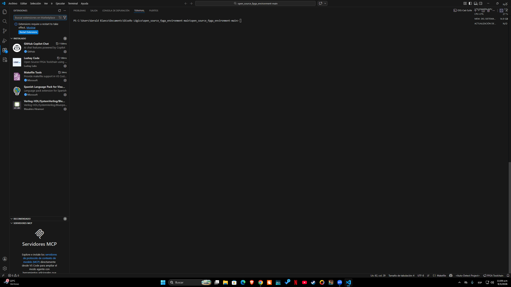

# Tutorial: Open Source FPGA Environment

Este repositorio documenta el proceso de realización del tutorial **Open Source FPGA Environment**, el cual enseña a configurar y utilizar herramientas de código abierto para el desarrollo de proyectos en FPGA utilizando la tarjeta **Tang Nano 9K**.

El objetivo de este repositorio es mostrar paso a paso el desarrollo del tutorial y evidenciar cada una de las etapas mediante capturas de pantalla.

Tutorial original:  
https://github.com/FZumb4do/open_source_fpga_environment/wiki

---

# Parte 1 – Instalación de las herramientas

En esta primera parte se configuró el entorno de desarrollo necesario para trabajar con FPGAs utilizando herramientas de código abierto.

Durante esta etapa se realizaron las siguientes acciones:

- Instalación de **Visual Studio Code** como editor de desarrollo.
- Instalación de las extensiones necesarias como:
  - Lushay Code
  - Verilog-HDL / SystemVerilog
- Descarga e instalación del paquete **OSS-CAD-Suite**, el cual incluye herramientas como Yosys y otras utilidades necesarias para la síntesis y compilación de diseños FPGA.

Estas herramientas permiten escribir, compilar y programar diseños digitales directamente desde el entorno de desarrollo. :contentReference[oaicite:1]{index=1}

### Evidencia

---

# Parte 2 – Uso del toolchain para diseño en FPGA

En esta sección se exploró el funcionamiento del **toolchain de desarrollo FPGA**, el cual permite pasar desde el código HDL hasta la implementación en hardware.

Durante esta etapa se trabajó con:

- Navegación por los archivos del proyecto mediante terminal.
- Uso de comandos básicos como `cd` para moverse entre directorios.
- Simulación del diseño.
- Visualización de diagramas de tiempo.
- Uso de un **Makefile** para automatizar la compilación del proyecto.

El toolchain permite realizar el flujo completo de diseño digital: simulación, síntesis, place & route y generación del bitstream. :contentReference[oaicite:2]{index=2}

### Evidencia

---

# Parte 3 – Primer diseño: del RTL al Bitstream

En esta parte se realizó el primer diseño funcional utilizando el flujo de desarrollo configurado previamente.

Las actividades principales fueron:

- Creación del código en **Verilog (RTL)**.
- Compilación del diseño mediante el toolchain.
- Generación del **bitstream**.
- Preparación del diseño para ser cargado en la FPGA.

Este proceso representa el flujo típico de desarrollo en FPGA, donde un diseño escrito en HDL se transforma en una configuración programable para el dispositivo.

### Evidencia

---

# Parte 4 – Implementación en la FPGA

Finalmente, el diseño generado fue cargado en la FPGA para comprobar su funcionamiento en hardware real.

Durante esta etapa se realizó:

- Programación de la FPGA con el bitstream generado.
- Verificación del funcionamiento del diseño implementado.
- Validación del resultado mediante pruebas físicas en la tarjeta.

Esta etapa permite confirmar que el diseño digital funciona correctamente no solo en simulación, sino también en el hardware.

### Evidencia

---

# Conclusión

Este tutorial permitió aprender el flujo completo de desarrollo en FPGA utilizando herramientas de código abierto. Desde la configuración del entorno de desarrollo hasta la implementación final en hardware, se siguieron todas las etapas necesarias para desarrollar un proyecto digital funcional.

El uso de herramientas open source permite a estudiantes y desarrolladores trabajar con FPGAs sin depender de software propietario, facilitando el aprendizaje y la experimentación.
